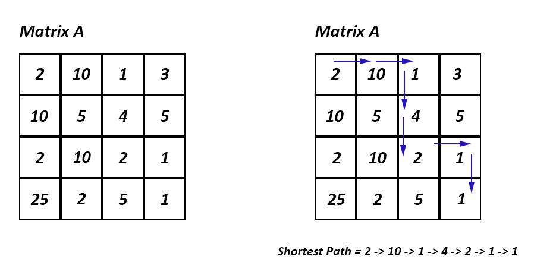

# VanHack Learning Hub Code Challenge - February 2023

## Shortest Path in a Matrix

Given a square matrix, find the shortest path from the top-left cell to the bottom-right cell. The product of all the numbers in the chosen path should have the least number of trailing zeros. You are **only** allowed to move in either the right or down directions.

***Note:** Diagonal, back or up movements are not allowed.*

### ***You may decide to take a different path in designing and implementing your solution. Happy coding.***

***VanHack Learning Hub***